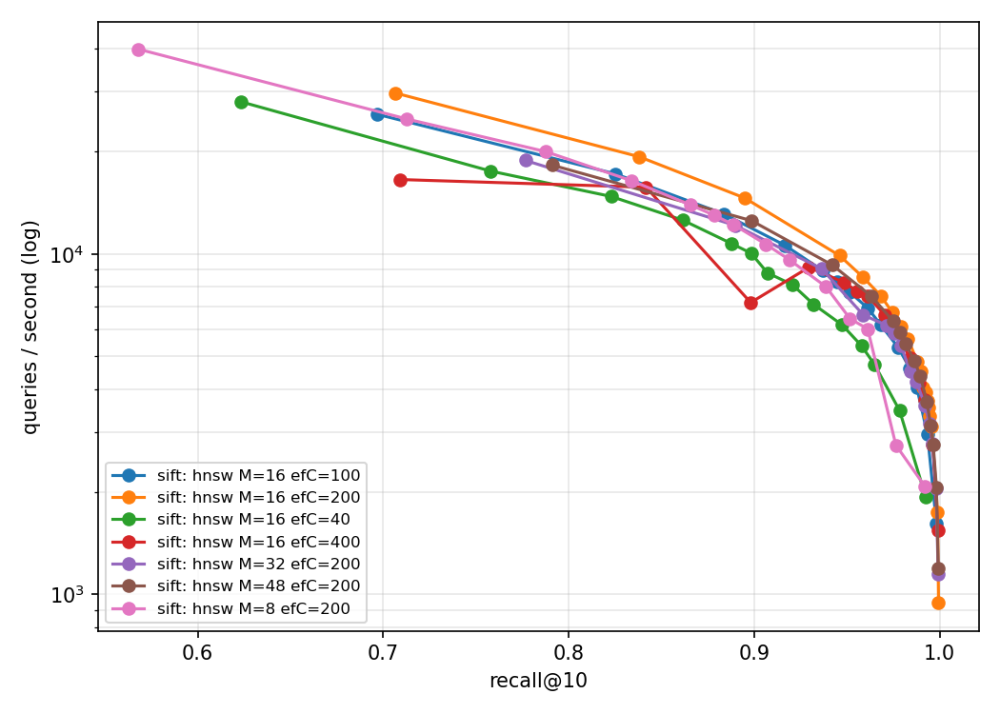

# hnsw-cpp

A from-scratch C++20 implementation of HNSW (Hierarchical Navigable Small World). I wrote it to learn systems programming, and I benchmark it against FAISS on the SIFT dataset. The core library has no ANN or linear-algebra dependencies.

## HNSW in simple words

Paper: [Malkov & Yashunin, *Efficient and robust approximate nearest neighbor search using Hierarchical Navigable Small World graphs*](https://arxiv.org/abs/1603.09320) (2016). Faiss, Weaviate, Qdrant, Milvus, Elasticsearch/OpenSearch and pgvector all offer HNSW. It serves semantic search, RAG retrieval and recommendations.

**The problem.** Given millions of items represented as vectors, find the ones most similar to a query. Comparing against every item is too slow, and exact tree-based shortcuts break down in high dimensions. Approximate nearest neighbor search accepts almost-best matches in exchange for a large speedup.

**The idea.** Finding an address, you start on a highway map with few points and long jumps, switch to a city map, then a street map. HNSW stores the data as a stack of proximity graphs.
- Layer 0 holds every item, linked to nearby neighbors.
- Higher layers hold exponentially fewer items, so their links span long distances. Each item's top layer is drawn at random, like a skip list over graphs.

**Search.** Start at the top layer and hop to whichever neighbor is closest to the query. When no neighbor is closer, drop a layer and continue from there. At layer 0, run a wider search of width `ef` and return the best K. The number of steps grows roughly with log(N), not N.

**Build.** Insert items one at a time. Pick a random top layer, search down from the top to find nearby nodes on each of the item's layers, then link the item to a selected few.

**The neighbor-selection heuristic.** Linking to the M closest nodes fails on clustered data, because all of them can sit in one cluster and the clusters never connect. The heuristic walks the candidates nearest-first and keeps one only if it is closer to the new item than to every neighbor already chosen. The kept links point in different directions, including across clusters.

| Parameter | Effect |
|---|---|
| `M` | Links per node. A higher value raises recall and memory use. |
| `efConstruction` | Search width while building. A higher value gives a better graph and a slower build. |
| `ef` (search) | Search width at query time. A higher value raises recall and lowers speed. This is the main speed/recall knob. |
| `mL` | Layer-height distribution. The paper suggests `1/ln(M)`. |

**Limitations noted by the authors.** HNSW uses more memory than compression-based methods such as product quantization. It is harder to distribute, since every search enters at the top layer. The original design has no deletes or updates. The log(N) bound is proven only under idealized assumptions, and the high-dimensional behavior rests on experiments.

## Layout

`include/hnsw` holds the public headers and `src` holds the library. `tools/eval.cpp` is the evaluation CLI. `tests` and `bench` hold the unit tests and microbenchmarks. `scripts` holds dataset download and plotting, and `data` holds the datasets and is gitignored.

## Build and test

You need CMake 3.24+, Ninja, and clang or gcc. CMake fetches GoogleTest and Google Benchmark.

```bash
cmake --preset release && cmake --build --preset release && ctest --preset release
```

The presets are `debug`, `release` (-O3, native CPU tuning), `asan` (ASan + UBSan) and `tsan`. Binaries land in `build/<preset>/` (`eval`, `hnsw_tests`, `bench_distance`).

## Dataset setup

```bash
scripts/download_sift.sh siftsmall   # 10K vectors, ~5 MB
scripts/download_sift.sh sift1m      # 1M vectors, ~160 MB download
```

Files go to `data/<name>/<name>_{base,query}.fvecs` and `<name>_groundtruth.ivecs`.

Run the evaluator and plot the results.

```bash
build/release/eval --dataset data/siftsmall --index bruteforce
build/release/eval --dataset data/sift --index hnsw --M 16 --ef-construction 100 --ef-search 10,20,50,100
scripts/plot_results.py results/results.csv      # recall@10 vs QPS (log) -> results/recall_qps.png
```

Each run appends rows to `results/results.csv`. The plot script draws one curve per `M` and `efConstruction` pair, so runs with the same pair but different seeds land on one zigzag curve. Keep them in separate CSVs.

## Roadmap

1. Harness: loaders, distance, brute force, recall, eval CLI, plotting, tests. Done.
2. Single-threaded HNSW. Done.
3. Parameter tuning of `M`, `efConstruction` and `ef`. Done, results below.
4. SIMD and profiling.
5. Concurrent inserts.
6. mmap persistence.
7. FAISS comparison with pybind11 bindings.

## Benchmark results

### Setup

- Dataset: SIFT1M, 1,000,000 base vectors, 10,000 queries, 128 dimensions.
- Metric: recall@10 against the exact ground truth, and queries per second (QPS).
- Build: release preset, single thread, scalar distance function. SIMD arrives in Phase 4.
- Seed 42 unless stated. Brute force reaches recall 0.9995 on this data, not 1.0, because of distance ties in the ground truth. Treat 0.9995 as the practical ceiling.

### Recommended setting

`M=16`, `efConstruction=100`.

| Target | `ef` | QPS | Mean latency | p99 latency |
|---|---|---|---|---|
| recall@10 ≥ 0.95 | about 59 | about 9,100 | about 110 µs | about 150 µs |
| recall@10 ≥ 0.99 | about 159 | about 4,000 | about 250 µs | about 350 µs |

The build takes 161 s, and layer 0 plus the vectors use about 0.65 GB (computed from the storage layout, not measured). If you need every bit of query speed and can spend 285 s on the build, use `efConstruction=200`. It is about 3% faster at recall 0.95 and about 10% faster at recall 0.99.

These numbers come from the seed 7 rerun, where `efConstruction=100` and `efConstruction=200` ran back to back. The first `efConstruction=100` run was slower for reasons outside the code (see Noise).

### Parameter sweep

Interpolated from the measured recall/QPS points, all on SIFT1M, `ef` swept from 10 to 800 (or 400).

| `M` | `efConstruction` | Build | `ef` at 0.95 | QPS at 0.95 | `ef` at 0.99 | QPS at 0.99 |
|---|---|---|---|---|---|---|
| 16 | 40 | 72 s | 105 | 6,000 | 366 | 2,200 |
| 16 | 100 | 188 s | 59 | 7,900 | 165 | 3,600 |
| 16 | 200 | 285 s | 53 | 9,500 | 132 | 4,400 |
| 16 | 400 | 618 s | 51 | 8,100 | 127 | 4,000 |
| 8 | 200 | 230 s | 118 | 6,600 | 375 | 2,200 |
| 32 | 200 | 437 s | 36 | 7,600 | 91 | 3,900 |
| 48 | 200 | 426 s | 34 | 8,600 | 83 | 4,300 |

The `efConstruction=100` row comes from the first, slower run. The back-to-back rerun in the recommendation above gives 9,100 and 4,000 QPS.



Each curve is one graph with `ef` swept along it. A curve that sits further up and to the right is better. The dip in the `M=16, efConstruction=400` curve near recall 0.9 is a noisy run, not a real effect (see Noise).

### What the sweeps show

- **`ef`.** At `M=16`, `efConstruction=200`, recall rises from 0.71 at `ef=10` to 0.946 at `ef=50` and 0.9956 at `ef=200`. It reaches 0.9993 at `ef=800`. Mean latency grows by about 1.3 µs per unit of `ef`, and p99 stays at 1.3 to 1.5 times the mean.
- **`efConstruction`.** Build time scales almost directly with it (72 s, 188 s, 285 s, 618 s). Going from 40 to 100 cuts the `ef` needed for recall 0.95 from 105 to 59. Going from 200 to 400 doubles the build time and gains no QPS. At `efConstruction=40` the graph tops out near recall 0.992 even at `ef=400`.
- **`M`.** `M=8` has the lowest QPS and the lowest recall ceiling, and saves only about 20% of the build time. `M=16`, 32 and 48 reach about the same QPS at equal recall, within noise. Larger `M` needs a smaller `ef` but spends more time on each hop, and it costs more build time and memory, so `M=16` wins.
- **Heuristic ablation.** Not run yet. The `--heuristic 0` flag turns the diversity heuristic off, and a run at `M=16`, `efConstruction=100` would show whether it helps on SIFT.

### Noise

- The seed changes recall by 0.0003 or less. Seed 42 and seed 7 at `M=16`, `efConstruction=200` reach 0.9585 and 0.9588 at `ef=60`.
- QPS for the same configuration varies by 3% to 16% between runs, depending on what the machine is doing. The `efConstruction=100` run at `ef=60` gave 7,742 QPS the first time and 8,994 QPS the second time, at the same recall.
- QPS can even fall out of order inside one run. One `efConstruction=400` run shows 7,200 QPS at `ef=30`, below the 9,141 QPS at `ef=40`.
- Treat QPS gaps under about 15% as noise unless a repeat run confirms them, and compare configurations from runs made back to back.

### Reproduce

```bash
build/release/eval --dataset data/sift --index hnsw --M 16 --ef-construction 100 --ef-search 10,20,30,40,50,55,60,70,80,100,120,140,160,200,400 --csv results/sweep.csv
scripts/plot_results.py results/sweep.csv -o docs/phase3_recall_qps.png
```

The plot lives in `docs/` because `results/` and `*.png` are gitignored. `.gitignore` has an exception for `docs/*.png`.
